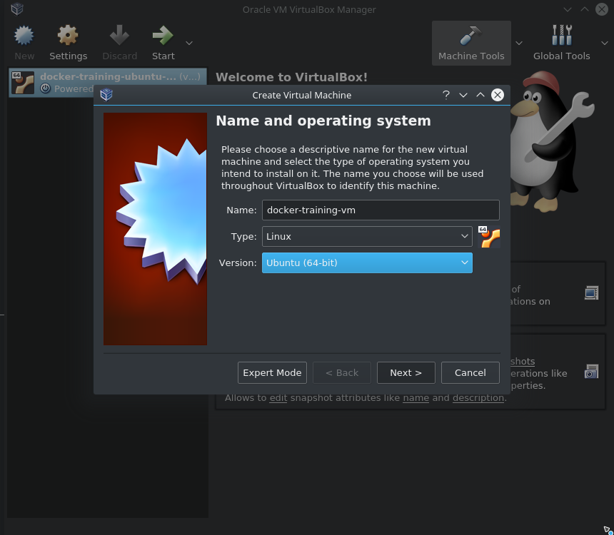
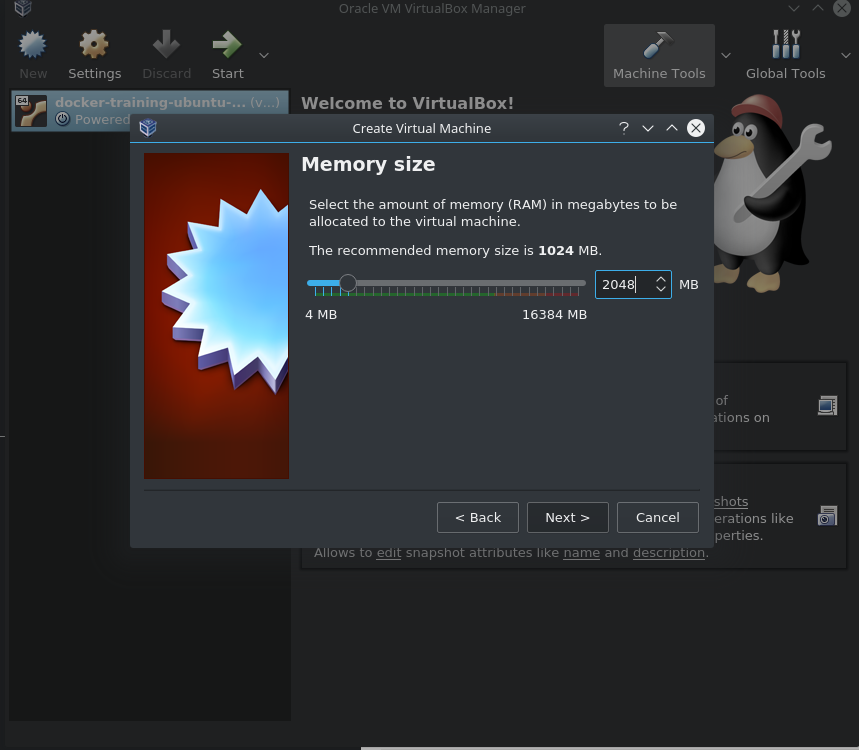
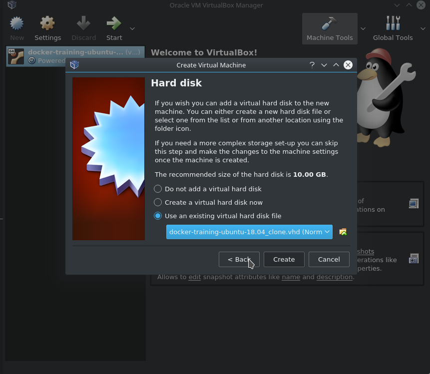
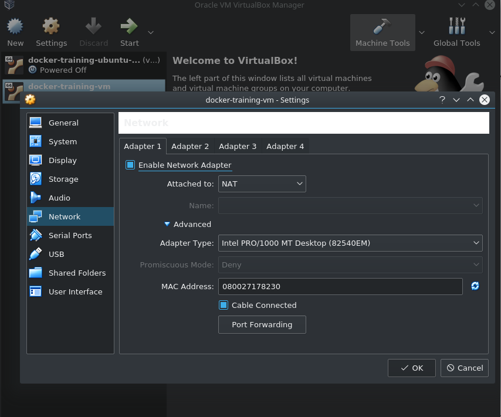
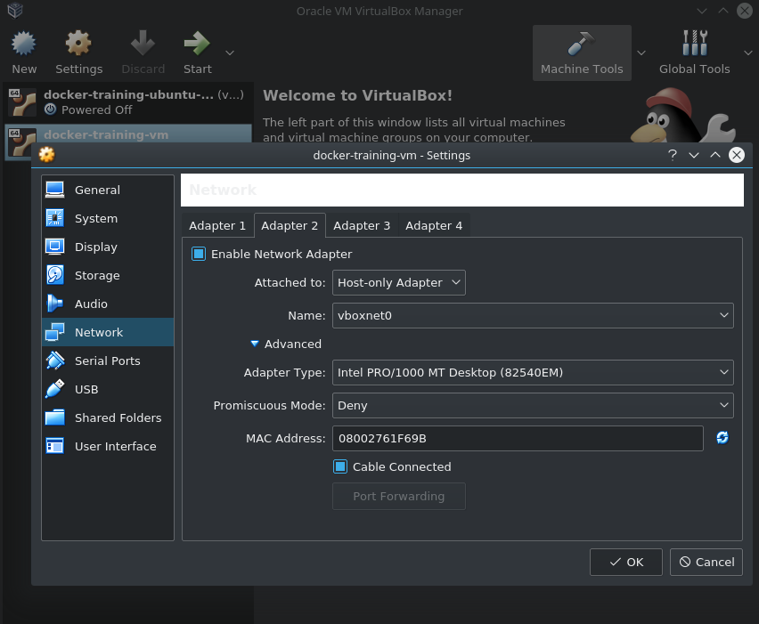

# Setup Virtualbox VM Ubuntu Server 18.04

We provide a Virtualbox VM with Ubuntu Server 18.04 (Bionic), which has all necessary packages installed. The documentation was
created on Linux, but is the same as for Windows Users, maybe the look and feel of Virtualbox is different.

## Setup Network Adapter
This section describes how to create and configure the __Host Only Network Adapter__ which is used
to make the Guest accessible by the Host.

. Go to __Global Tools / Host Network Manager__
. Click __Create__
. Set the following properties on the network adapter
** **Adapter Tab**
*** Select __Configure Adapter manually__
*** **IPv4 address: ** 192.168.56.1
*** **IPv4 Net-Mask:** 255.255.255.0
** **DHCP Server**
*** Unselect __Enable Server__
. Save and restart Virtualbox

## Import Appliance
This section describes how to import and configure the provided VM on your local machine.

. Click __New / Import Appliance__, configure as shown in the figure and click __Next__ +
  
. Set the intended RAM to use __(recommended 2GB)__ and click __Next__  +
  
. Select __Use existing virtual hard disk file__, set the location of the VHD we provided and click __Next__   +
  

## Setup VM Network
This section describes how to configure the newly imported appliance network. The MAC addresses are generated during the import and do not need to be changed.

. Right click the imported VM and click __Settings__, go to __Network__ and configure as shown in the figures   +
  The NAT network is used for Internet access +
   +
  The __Host Only Network__ is used to connect the HOST to the VM. +
  

## Access the VM
The Guest can be accessed either via Virtualbox Window or via the Host command line. +
The following users are available on the VM.

.Available users
[options="header"]
|==========================
|      Username|Password|SSh enabled
|docker|docker|yes
|root|root|no
|==========================

The Ubuntu VM has been configured to use a static IP which is **192.168.56.101**. The following commands shows ho to
ssh into the VM via the command line.

[source,bash]
----
$ ssh docker@192.168.56.101
----
